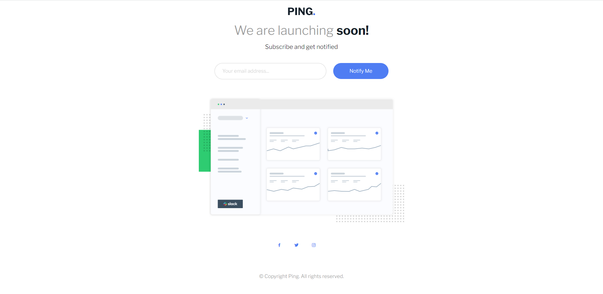

# Frontend Mentor - Ping coming soon page solution

This is a solution to the [Ping coming soon page challenge on Frontend Mentor](https://www.frontendmentor.io/challenges/ping-single-column-coming-soon-page-5cadd051fec04111f7b848da). Frontend Mentor challenges help you improve your coding skills by building realistic projects. 

## Table of contents

- [Overview](#overview)
  - [The challenge](#the-challenge)
  - [Screenshot](#screenshot)
  - [Links](#links)
- [My process](#my-process)
  - [Built with](#built-with)
  - [What I learned](#what-i-learned)
  - [Continued development](#continued-development)
  - [Useful resources](#useful-resources)
- [Author](#author)
- [Acknowledgments](#acknowledgments)

**Note: Delete this note and update the table of contents based on what sections you keep.**

## Overview

### The challenge

Users should be able to:

- View the optimal layout for the site depending on their device's screen size
- See hover states for all interactive elements on the page
- Submit their email address using an `input` field
- Receive an error message when the `form` is submitted if:
	- The `input` field is empty. The message for this error should say *"Whoops! It looks like you forgot to add your email"*
	- The email address is not formatted correctly (i.e. a correct email address should have this structure: `name@host.tld`). The message for this error should say *"Please provide a valid email address"*

### Screenshot




### Links

- Solution URL: [Check out the code](https://github.com/TheCoderGuru/ping-coming-soon-page/)
- Live Site URL: [View it Live](http://ping-coming-soon-page-kappa-red.vercel.app/)

## My process

### Built with

- Semantic HTML5 markup
- CSS custom properties
- Flexbox


### What I learned

This is my first attempt of this challenge and this reiterated the following css properties


- justify-content

- align-items

- gap

- flex


Here is a snippet of how it was used in this challenge


```css

.flex-group{
  display: flex;
  flex-direction: row;
  align-items: baseline;
  justify-content: center;
  width: 30vw;
  margin-left: 42rem;
  margin-top: 1rem;
}
```


### Continued development

I plan to continue using css flexbox in as much projects as required so that I can be a bit more familiar with the various css properties that encompasses the flexbox concept.


### Useful resources

- [CSS Tricks - CSS Flexbox](https://css-tricks.com/snippets/css/a-guide-to-flexbox/) - This helped me with the flexbox concept and I am really glad to be recommend this article, will use it going forward.

- [MDN CSS Reference](https://developer.mozilla.org/en-US/docs/Web/CSS) - This is the guide to all the css properties with an indept explanation. Definitely recommend it.


## Author

- Frontend Mentor - [@TheCoderGuru](https://www.frontendmentor.io/profile/TheCoderGuru)
- Twitter - [@TheCoderGuru](https://www.twitter.com/TheCoderGuru)


## Acknowledgments

I would like to thank [Mariem Bchir](https://github.com/Mabchir) for her assistance in providing valuable and indept feedback on this challenge.

Check out her [Frontend Mentor](https://www.frontendmentor.io/profile/Mabchir) profile.
